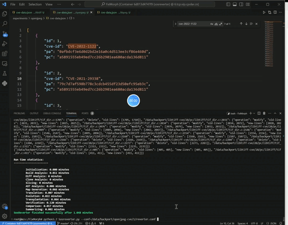

## SosReverterbench
this is SosReverter experiments and data

### NVDCVE

In the NVDCVE folder, the CVE folder is the crawled CVE data from 2015 to 2023, and the CVEdataset is the processed data for query.

### demos

We will first run demos to verify SosRverteris working.

### demo run

Can check if demos is working well by running the above deom from our demos
```
python3.7 Sosreverter.py --conf=demos/TypeII/insert/method-arg/reverter.conf
```

### programs experiments

In /programsetup/[program], a python driver is provided run [program] experiments,we can run all the experiments using the following command

```
python3.7 driver.py --data=cve-data.json
```
we can also manually run the Tool later by run following command:
```
python3.7 driver.py --data=cve-data.json --only-setup
```
after setting up, we can run experiment manually

```
python3.7 Sosreverter.py --conf=/path/to/configuration
```

### Run experiment 

run CVE-2022-0909 and  cve-2022-1122 as examples

```
cd programsetup/libtiff & 
python3.7 driver.py --data=cve-data.json --only-setup

cd programsetup/openjpeg & 
python3.7 driver.py --data=cve-data.json --only-setup
```
next step is run SosReverter with experiment configuration:

#### cve-2022-0909
```
python3.7 Sosreverter.py --conf=/data/backport/libtiff-cve/28/reverter.conf
```


#### cve-2022-1122
```
python3.7 Sosreverter.py --conf=/data/backport/openjpeg-cve/1/reverter.conf
```


### benchprograms.tar.gz

They are benchmark programs

### need todo:

- integrate Sosbench into Magma in future work.
- The code for the SosReverter tool is currently being organized, and we will soon release it on github.
